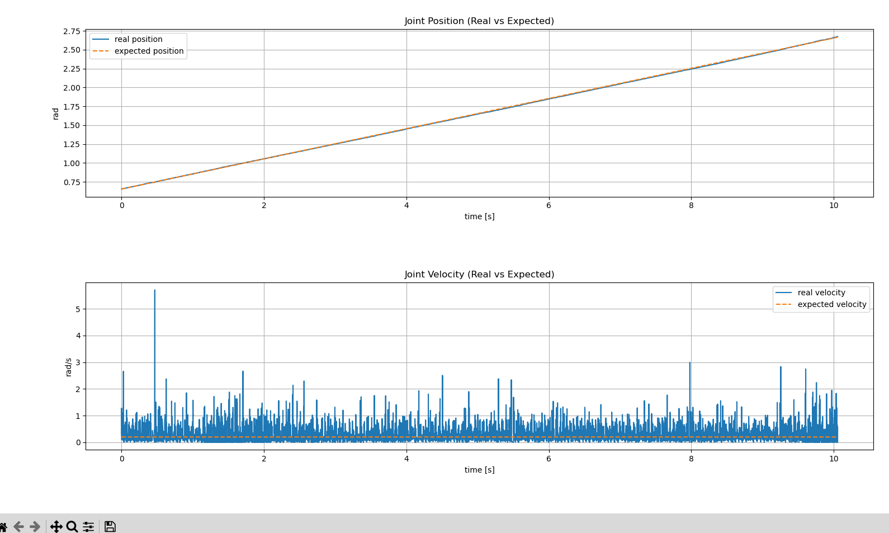
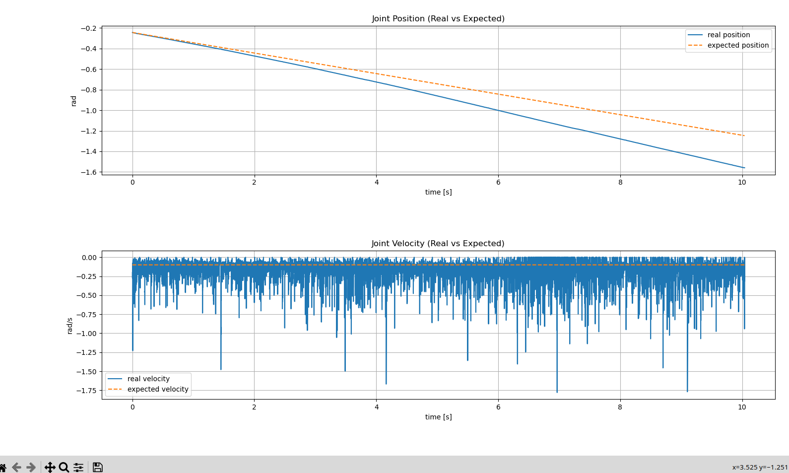
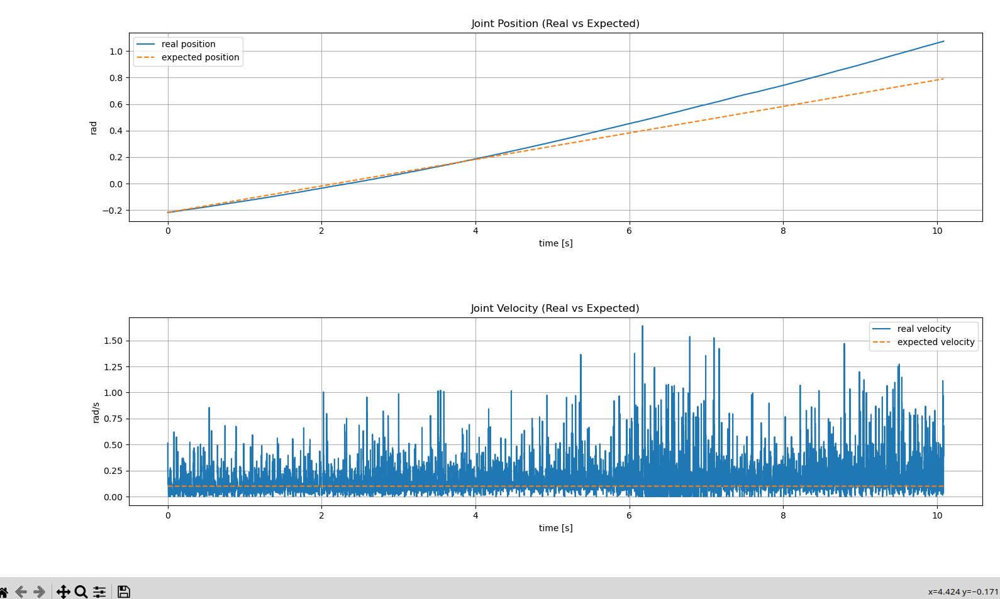
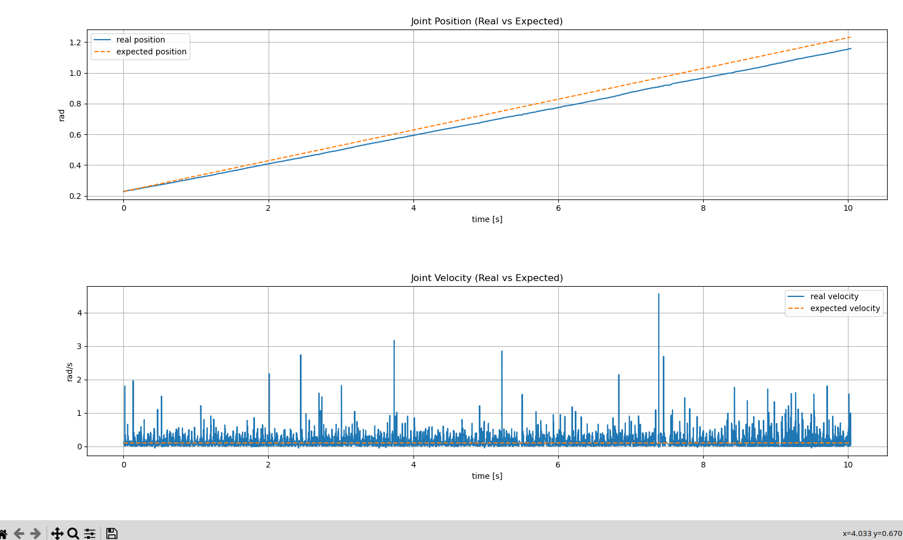
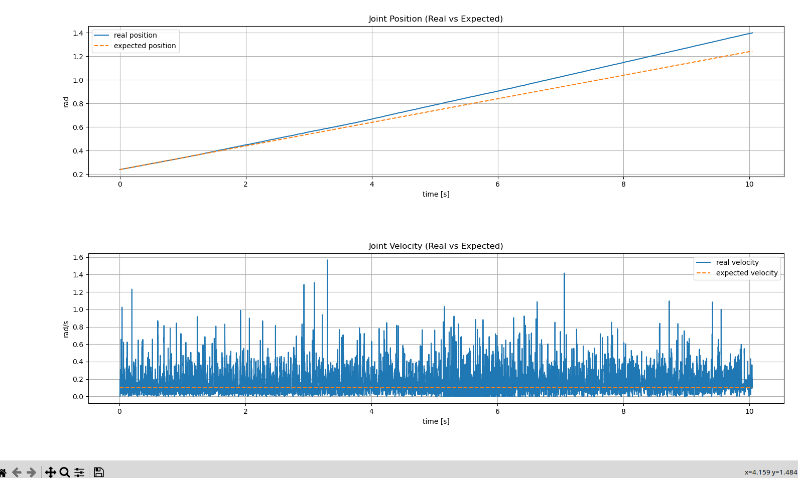
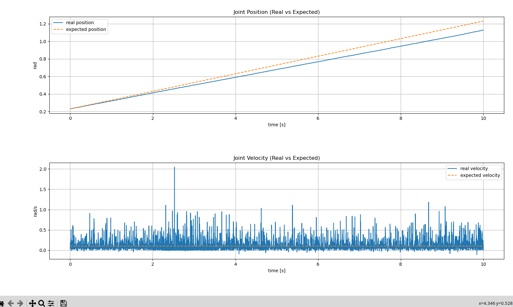

# KINOVA GEN3 LITE VELOCIΤY CONTROLLER 

The Kortex driver for the Kinova Gen3 Lite does not support direct joint velocity command streaming; it primarily exposes trajectory-based control interfaces, even though the underlying hardware itself is capable of velocity-level control.

That’s why I created this velocity controller, which in simple terms sends high-frequency small trajectory commands to the robot, effectively simulating joint velocity control.

**IMPORTANT NOTICE: If you plan to use the code for your robot, you need to change the topics names to match with your robot**

## How it works

- It receives velocity inputs (v1 ... v6)
- Numerically integrates them into joint positions
- Sends JointTrajectory position commands at a fixed frequency

## Core Idea: Fake Velocity Control

Since direct velocity control is not available,  we approximate it using numerical integration.

### Discrete Integration Model

$$
q_{k+1} = q_k + v_k \cdot \Delta t \cdot K
$$

where:

- $q_k$ is the current joint position estimate  
- $v_k$ is the commanded joint velocity  
- $\Delta t$ is the control loop time step  
- $K$ is the velocity gain (tuning factor)

Tuning Factor played a high role in making the controller as precise as possible, while we keep dt as low as possible.

## Control Loop

The controller runs at fixed frequency:

```dt = 0.05s  (20 Hz)```

At every cycle:
- 1: It reads the velocity commands 
- 2: Safety clamp: It limits the velocity range in [-1,1]. You can paramerize it as you wish.
- 3: It updates the states of the joints' angles:
  
  ```q_cmd += v * dt * gain```
- 4: It publishes the trajectory

## Initialization Phase

Before control starts:

- 1: Node waits for first DynamicJointState topic to receive information about it.
- 2: Extracts joint positions
- 3: Builds initial state vector:
  
  ```q_cmd = [q1, q2, ..., q6]```
- 4: Enables controller (initialized = True)

This part of the algorithm is very important. For example, if you command the robot to move from 0 degrees to 0.2, but in reality it is located at -30 degrees, it will attempt to catch up to the commanded trajectory. As a result, a highly **chaotic and abrupt motion** may occur.

## Testing accuracy of the algorithm.
First of all, all tests were conducted on the real robot hardware and not in simulation

With the help of AI, I created a script that reads real-time joint state data from the robot using a ROS2 subscription to `DynamicJointState`. The script focuses on a selected joint and computes its actual velocity by numerically differentiating position measurements over time. It also records both position and velocity samples during the execution of a commanded motion. After the test duration is completed, the collected data is processed and compared against the expected constant velocity profile. Finally, the script generates plots and error metrics to evaluate the tracking performance and steady-state behavior of the joint under the given velocity command.

The test scenario is that I constantly send velocity commands at one joint at a time(6 individual tests) and simultaneously the test script is running for 10 seconds(it can be changed).

Below I will place the plots of each joint, but you can check [here](tests/test_results_for_each_joint.txt) the test results for each joint in more detail.

## Test Results with plots: Expected VS Actual

### Joint 1



### Joint 2



### Joint 3



### Joint 4



### Joint 5



### Joint 6



## Test Conclusions

The positive outcome is that the errors are very small across all joints, and the expected values closely match the actual ones, with a few exceptions that are likely expected. Due to vibrations, the velocity measured from the robot exhibits several significant fluctuations compared to the commanded velocity, which is, however, entirely expected. Additionally, the joints that rotate around the Z-axis are less affected by gravity-related effects, unlike the other joints, since they do not have to lift or lower any load.

**Update:** After conducting more tests, I observed that the gravity factor plays a very significant role in the controller’s behavior, since there is no control over the effort required by a joint to achieve a specific velocity. As a result, the following behaviors were observed:

If a given joint is not heavily affected by gravity, or is only slightly affected by it, the expected velocity and trajectory match the real values almost perfectly. However, if the joint attempts to move in a direction opposite to gravity, the robot performs abrupt and non-smooth motions. In addition, the estimated trajectory and velocity differ significantly from the actual values.

Finally, when the robot moves in the direction of gravity, the motion becomes smoother because gravity assists the movement. However, the resulting velocity becomes greater than the desired one, and therefore both the estimated velocity and the trajectory once again deviate from the real values.


## How to use the controller (via terminal)

- 1: Clone this repo(which plays the role of the workspace)
- 2: Open a terminal while being inside the repo's folder and type:

    ```
    colcon build
    source install/setup.bash
    ```
- 3: Execute the controller 
    ```
    ros2 run velocity_controller_pkg joint_velocity_controller\
  --ros-args \
  -p v1:=0.1 \
  -p v2:=0.0 \
  -p v3:=0.0 \
  -p v4:=0.0 \
  -p v5:=0.0 \
  -p v6:=0.0
    ```
### Example for the case you want to make tests 

```
ros2 run tests_pkg steady_state_velocity_test \
  --ros-args \
  -p joint:=arm_0_joint_1 \
  -p cmd_velocity:=0.1 \
  -p duration:=5.0
```

